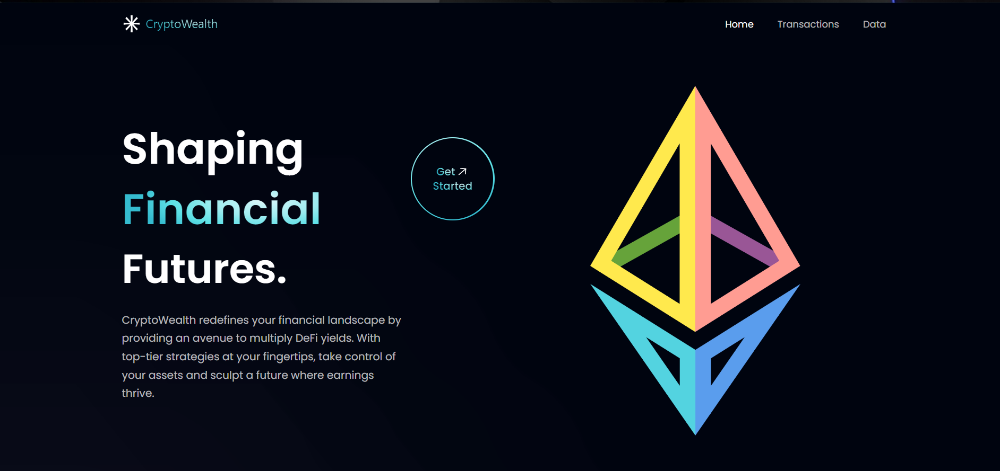
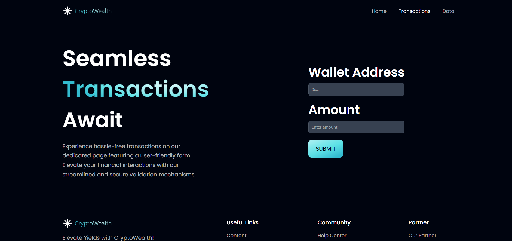
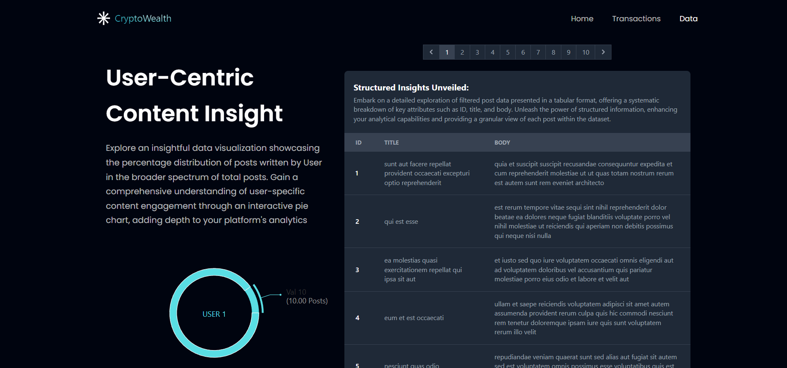

# React.js Web Application - Assignment Submission

This web application is designed and developed as part of the React.js developer assignment. The primary goals are to showcase skills in React.js, React Router navigation, form input validation, error handling, and data visualization using reCharts.

## Deployed Link
[Link](https://crypto-wealth.vercel.app/)


## Installation

1. Clone the repository
2. Install the dependencies using `npm install`

## Running the Application

Run the application using `npm run dev`

## Features

1. **Home Page**
   - 
2. **Transaction Page**
   - 
3. **Data Page**
   - 

# Features

## React Router Navigation
Seamless navigation between Home, Transaction, and Data pages.

## Transaction Page (Form Input Validation)
Form for user's wallet address and amount.
- Wallet Address validation: Should not be empty and must follow the standard Ethereum address format (0x...).
- Amount validation: Ensure the amount entered is a number and within a specified range (0 - 10,000).
- Bonus: Data submission to Google Firestore database.

## Data Page
Fetches data from the open-source API - 'https://jsonplaceholder.typicode.com/posts'.
- Filters posts to include only those with a user ID of 1.
- Visualizes filtered data in a table format.
- Includes a pie chart representing the number of posts written by user ID 1 out of total posts.

# Technologies Used
- React JS
- Axios for API requests
- D3.js for data visualization
- CSS for styling

# Installation
Clone the repository:
```bash
git clone https://github.com/your-username/your-repo.git
```
Navigate to the project directory:
```bash
cd your-repo
```
Install dependencies:
```bash
npm install
```
